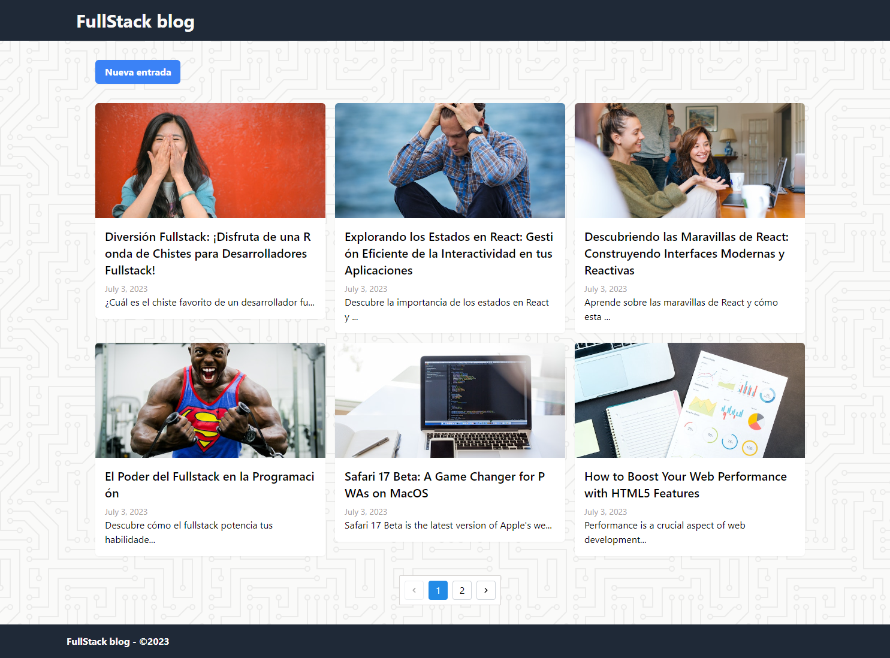
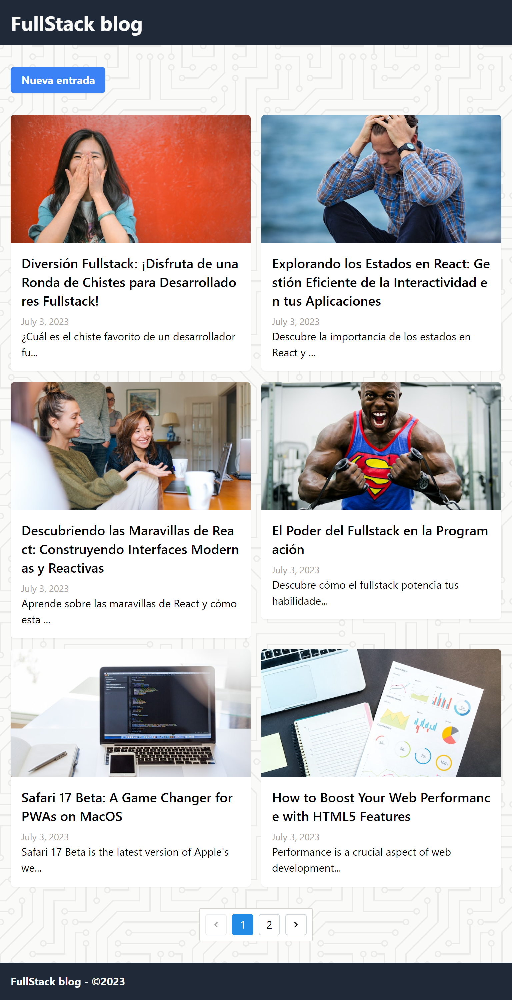
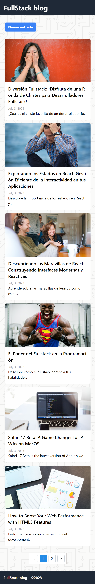
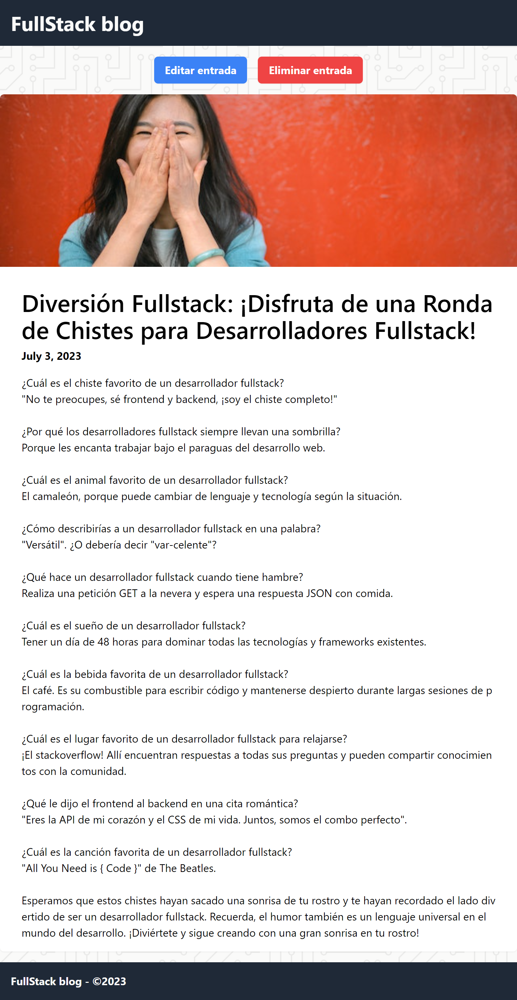
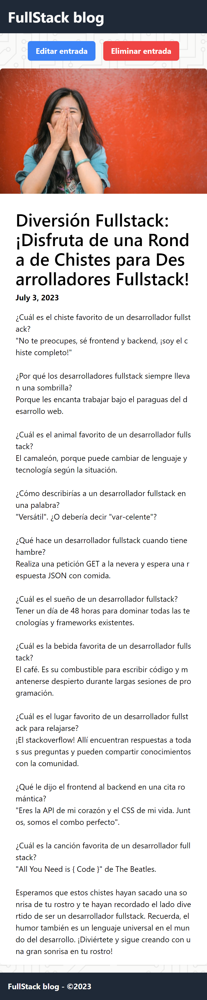
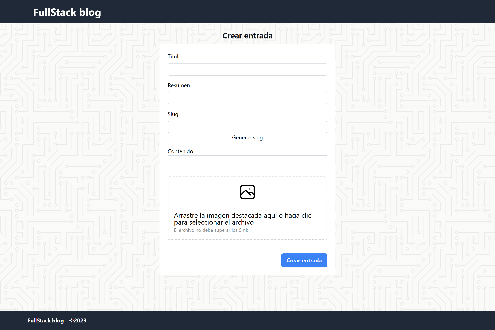
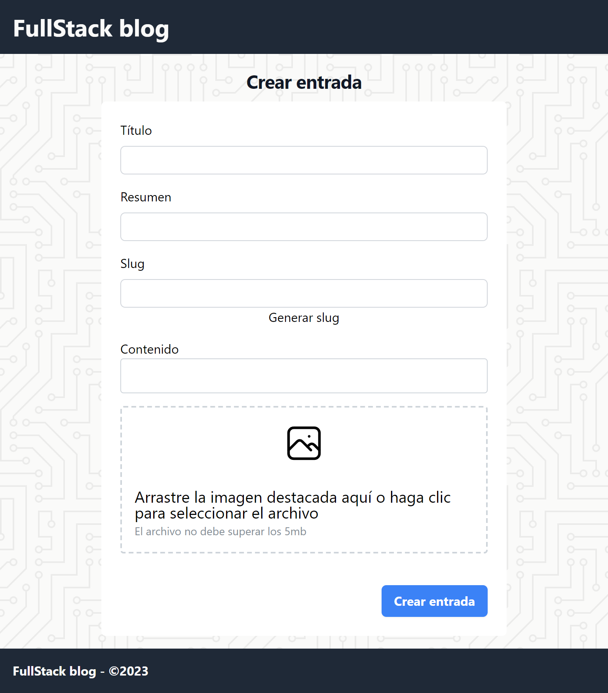
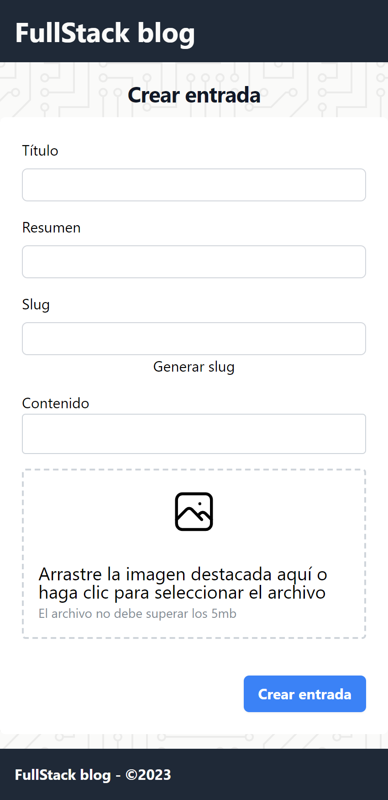

# Instalación y ejecución

Para instalar y ejecutar el proyecto, sigue los siguientes pasos:

- **Ejecuta el script.sql** en una instancia de MySQL
- **Coloca el archivo .env** en la carpeta /src/backend/
- **Instala las dependencias**. Abre una terminal en la raíz del proyecto y ejecuta el comando `npm i`. Esto instalará todas las dependencias necesarias para el frontend y el backend.
- **Ejecuta el proyecto**: Para ejecutar el proyecto, dirígete a la sección "Run and Debug" de Visual Studio Code. Dentro de esa sección, selecciona la opción "React + Backend". Esto iniciará tanto el frontend como el backend de la aplicación, permitiéndote probar y depurar el proyecto de manera integrada.

# Imágenes

## Feed

## Post

## New post

