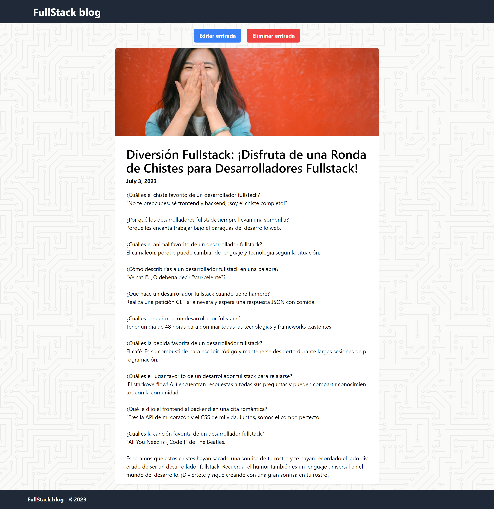

## Tech Stack
- React, Vite, Tailwind, Mantine UI
- NodeJS, ExpressJS  
- TypeScript, ESLint, Prettier
- MySQL

## Installation and execution

To install and run the project, follow the steps below:

- **Run the script.sql** on a MySQL instance.
- **Place the .env file** in the /src/backend/ folder.
- **Install the dependencies**. Open a terminal at the root of the project and run the `npm i` command. This will install all the necessary dependencies for the frontend and backend.
- **Run the project**: To run the project, go to the "Run and Debug" section of Visual Studio Code. Within that section, select the "React + Backend" option. This will start both the frontend and backend of the application, allowing you to test and debug the project in an integrated way.

## .env

PORT=3001

HOST=localhost

USER=root

DATABASE=gestion_blogs

JWT_TOKEN=secret

## Showcase

### Feed

### Post

### New post

